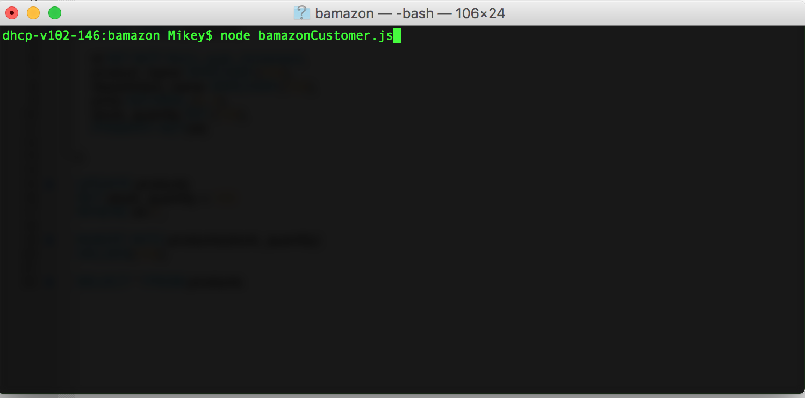
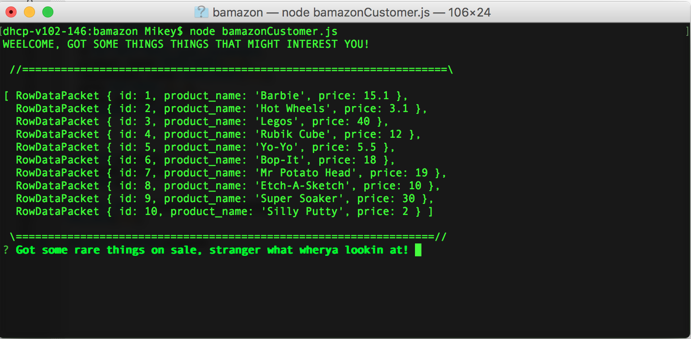
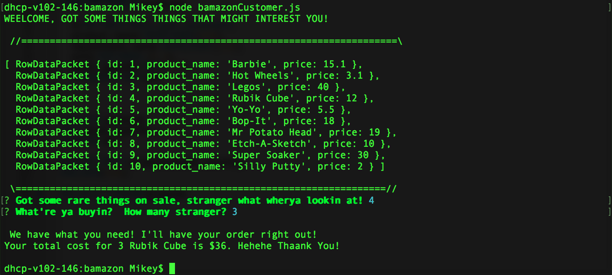

# bamazon
Application that allows user to purchase products from the bamazon client via NODE.JS

# How to use bamazon

First Navigate to wherever you have stored the bamazon folder and open up it up via terminal/command prompt.

Next open up the appropiate javascript file named *node bamazonCustomer.js*.  It should look like the picture 
below.

After that fill out the appropiate prompts that are shown.  __DO NOT__ Type text as the program will not allow
you to continue; your screen should look like the picture below.

Lastly you should get a message prompting whether your purchase could go through or not!

[]
